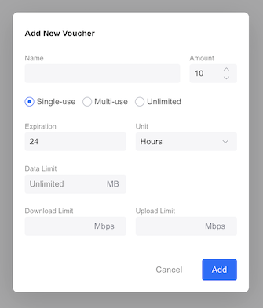

# UniFi Network Application - Go Voucher Generator

### Origin Story 
After setting up Ubiquiti access points at my place, I aimed to offer straightforward Guest Wi-Fi. I didn't want to use a PSK. However, I also needed to ensure that only people inside my home could use it, avoiding external access. To solve this, I introduced a button that generates a small voucher code upon being pressed.

### Overview

The is an open-source Golang library designed to interface with the UniFi Network Application dashboard, facilitating the automated generation and fetching of new vouchers for WiFi hotspot landing pages.

By enabling the programmatic generation of vouchers, this library hopes to broaden the scope for creating better guest Wi-Fi experiences.


## Installation

```bash
go get -u github.com/jeremyforan/UnifiVoucherGenerator
```

## Usage

A basic example of the library creating a basic voucher.

```go
package main

import (
	"fmt"
	"github.com/jeremyforan/UnifiVoucherGenerator"
	"github.com/jeremyforan/UnifiVoucherGenerator/voucher"
	"log/slog"
	"net/url"
)

func main() {

	// URL of the Unifi controller.
	baseUrl, err := url.Parse("https://127.0.0.1:8443")
	if err != nil {
		panic(err)
	}

	// Create a new client with the username, password, and URL of the Unifi controller.
	client := UnifiVoucherGenerator.NewClient("user@email.com", "p455w0rd", baseUrl)

	// Login to the Unifi controller.
	err = client.Login()
	if err != nil {
		slog.Info("Failed to login to Unifi controller")
		panic(err)
	}

	// Create a new voucher with default settings.
	v := voucher.NewDefaultVoucher()

	// Add the Voucher to the Unifi controller.
	err = client.AddVoucher(v)
	if err != nil {
		slog.Error("unable to add voucher")
		panic(err)
	}

	fmt.Println(v.AccessCode())
}
```

### Voucher Types



```go
v := voucher.NewDefaultVoucher()

v := voucher.NewSingleUseVoucher()

v := voucher.NewMultiUseVoucher(5)

v := voucher.NewUnlimitedUseVoucher()

```

### Expiration

You can set the expiry of a voucher using the SetExpire method.

```go
v := voucher.NewDefaultVoucher()

// Voucher will expire 7 days from the moment a guest enters it into the landing page.
v.SetExpire(7, voucher.Days)

// Voucher will expire 8 hours from the moment a guest enters it into the landing page.
v.SetExpire(8, voucher.Hours)

// Voucher will expire 59 minutes from the moment a guest enters it into the landing page.
v.SetExpire(59, voucher.Minutes)
```

### Network Limits

You can set the network usage limits with the following:

```go
v := voucher.NewDefaultVoucher()

// Set download to 10Mbps and upload to 2Mbps
v.SetDownloadLimitMbps(10)
v.SetUploadLimitMbps(2)

// Set data limit to 100MB
v.SetDataLimitMB(100)
```

## Contributions

Pull requests are welcome. Feel free to...

- Revise documentation
- Add new features
- Fix bugs
- Suggest improvements


## Limitations

- This has only been tested on a locally deployed instance of the [Unifi Network Appliance - v8.1.113](https://community.ui.com/releases/UniFi-Network-Application-8-1-113/af46fd38-8afe-4cef-8de1-89636b02b52c) 
- Using [slog](https://go.dev/blog/slog), which requires Go 1.21
- Currently this only does a single voucher at a time.

## Feedback

Pull requests are welcome. Feel free to...

- Revise documentation
- Add new features
- Fix bugs
- Suggest improvements

## License

[MIT](https://choosealicense.com/licenses/mit/)

